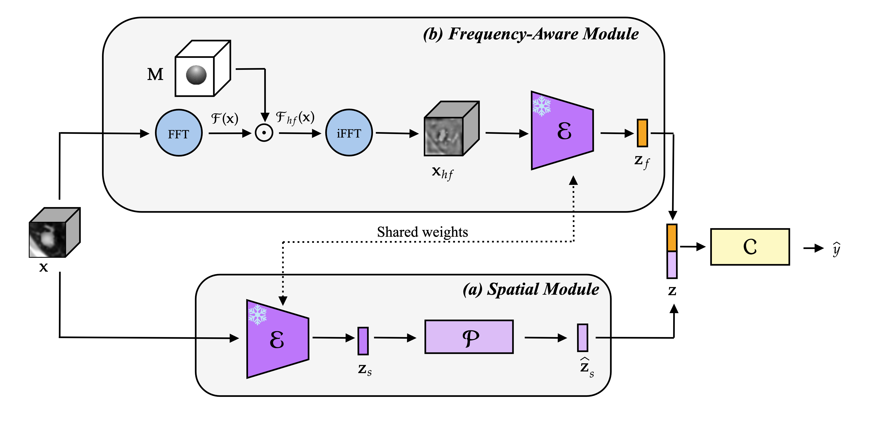

# Robust Unseen-Generator Detection of Semantic Manipulations in CT Imaging

[Ludovica Pompilio](https://scholar.google.com/citations?user=fF5lJeUAAAAJ&hl=it&oi=ao)<sup>1</sup>, [Francesco Di Feola](https://scholar.google.com/citations?user=nzm0qagAAAAJ&hl=it&oi=ao)<sup>2</sup>, [Matteo Tortora](https://scholar.google.com/citations?user=3WpZse0AAAAJ&hl=it&oi=ao)<sup>3</sup>, [Valerio Guarrasi](https://scholar.google.com/citations?user=840UXEMAAAAJ&hl=it&oi=ao)<sup>4</sup>, [Paolo Soda](https://scholar.google.com/citations?user=E7rcYCQAAAAJ&hl=it&oi=ao)<sup>1,2</sup>

<sup>1</sup> Research Unit of Artificial Intelligence and Computer Systems, Campus Bio-Medico di Roma, Rome, Italy

<sup>2</sup> Department of Diagnostics and Intervention, Radiation Physics, Biomedical Engineering, Umeå University, Umeå, Sweden

<sup>3</sup> Department of Naval, Electrical, Electronics and Telecommunications Engineering, University of Genoa, Genoa, Italy

<sup>4</sup> UniCamillus-Saint Camillus International University of Health Sciences, Rome, Italy



## Method overview

This repository implements a patch-level detector of semantic manipulations in lung CT images.
The detector analyzes each patch through two complementary views. The spatial branch processes the original patch; the frequency-aware branch applies a 3D Fourier transform, retains frequencies outside a radial cutoff (`α = 0.25`), and reconstructs a high-frequency patch with the inverse transform. A frozen, pretrained encoder extracts an embedding from each view. A learned projection maps the spatial embedding into a shared feature space; the projected spatial and frequency embeddings are concatenated and classified by a linear head. 

Evaluation follows a leave-one-generator-out protocol with CycleGAN (`cycle`), Pix2Pix (`pix2pix`), and DDPM (`diffusion`). In each of three runs, real patches and manipulations from two generators are used for training and validation. Testing measures in-distribution (ID) performance on those generators and out-of-distribution (OOD) performance on the held-out generator.

## Repository layout

```text
.
├── README.md
├── requirements.txt
├── data/
│   ├── Dataloader.py
│   ├── LIDC.csv
│   ├── data_new2.csv
│   ├── sets_new2.csv
│   └── LIDCIDRI_scan_stats/
│       └── LIDCIDRI_scan_stats_merged.csv
├── preprocessing/
│   ├── LIDCIDRI_dataset_utils.py
│   ├── M3DSynth_dataset_utils.py
│   ├── extract_patches.py
│   ├── save_LIDCIDRI_scan_metadata.py
│   └── tiff_utils.py
└── scripts/
    ├── compute_FFTorIFFT/
    │   └── compute_FFTorIFFT.py
    ├── extract_embeddings/
    │   ├── extract_emb.py
    │   └── src/
    │       └── spectre/
    └── training_evaluation/
        ├── train_evaluate_singlebranch_detector.py
        └── train_evaluate_spatialfrequency_detector.py
```

## Environment

Python 3.11 is recommended.
Install the project dependencies before running any script.

```bash
pip install -r requirements.txt
```

## Data layout

```text
<real-root>/
└── <orig_id>/
    ├── slide0000.tiff
    ├── slide0001.tiff
    └── ...

<fake-root>/
└── <mod>/
    ├── scan/
    │   └── <img_id>/
    │       ├── slide0000.tiff
    │       └── ...
    └── label/
        └── <img_id>/
            ├── slide0000.tiff
            └── ...
```

Here, `orig_id` identifies the source LIDC-IDRI scan, `img_id` identifies a manipulation, and `mod` identifies its generator (for example, `cycle`, `diffusion`, or `pix2pix`). Slice filenames must start at `slide0000.tiff` and be numbered consecutively.

The following metadata files are already included in `data/` and are read by the extractor:

| File | Required fields | Purpose |
| --- | --- | --- |
| `data/data_new2.csv` | `img_id`, `orig_id`, `mod`, `ty` | Selects samples by generator and manipulation type. |
| `data/sets_new2.csv` | `orig_id`, `set` | Assigns each source scan to `train`, `valid`, or `test`. |
| `data/LIDCIDRI_scan_stats/LIDCIDRI_scan_stats_merged.csv` | `orig_id`, `min_export`, `rescale_slope`, `rescale_intercept` | Restores Hounsfield units from the stored TIFF values. |
| `data/LIDC.csv` | `orig_id`, `spacing_z`, `spacing_y`, `spacing_x` | Supplies voxel spacing for resampling to 1 mm isotropic resolution. |

## Train and evaluate the detector using a leave-one-generator-out protocol

### 1 - Extract patches

Run `preprocessing/extract_patches.py` from the repository root. Set `REAL_ROOT` and `FAKE_ROOT` to the input directories described in [Data layout](#data-layout):

```bash
REAL_ROOT=/path/to/real-root
FAKE_ROOT=/path/to/fake-root

for split in train valid test; do
    python preprocessing/extract_patches.py \
      --data-root-real "$REAL_ROOT" \
      --data-root-fake "$FAKE_ROOT" \
      --data-csv data/data_new2.csv \
      --sets-csv data/sets_new2.csv \
      --lidc-stats-csv data/LIDCIDRI_scan_stats/LIDCIDRI_scan_stats_merged.csv \
      --mods real,cycle,pix2pix,diffusion \
      --ty "inj" \
      --set-name "$split" \
      --value-space hu \
      --value-normalization hu-clip-01 \
      --sample-format npy \
      --output-dir preprocessed_cubes
done
```

Outputs are written to `preprocessed_cubes/<split>/inj/<mod>/samples/<img_id>.npy`, with a corresponding CSV under `metadata/<img_id>.csv` in the same `<mod>` directory.

### 2 - Reconstruct high-frequency patches

Run `scripts/compute_FFTorIFFT/compute_FFTorIFFT.py` on the `.npy` patches from Step 1. The paper uses a 3D radial high-pass mask with cutoff ratio `α = 0.25`, followed by an inverse FFT to obtain the spatial high-frequency reconstruction:

```bash
for split in train valid test; do
  python scripts/compute_FFTorIFFT/compute_FFTorIFFT.py \
    --data-root preprocessed_cubes \
    --mods real,cycle,pix2pix,diffusion \
    --ty inj \
    --set-name "$split" \
    --sample-format npy \
    --freq hf \
    --mode ifft \
    --cutoff 0.25 \
    --norm-mode raw \
    --output-dir reconstructed_hf_patches
done
```

Each patch is saved as `reconstructed_hf_patches/<split>/inj/<mod>/samples/<img_id>.npy`, with a corresponding CSV in `metadata/<img_id>.csv`. 

### 3 - Extract embeddings

Run `scripts/extract_embeddings/extract_emb.py` twice for each split: once on the spatial patches from Step 1 and once on the high-frequency IFFT reconstructions from Step 2. The pretrained encoder processes each 32×32×32 patch as a 2×2×2 grid of 16×16×16 windows:

```bash

for split in train valid test; do
  python scripts/extract_embeddings/extract_emb.py \
    --data-root preprocessed_cubes \
    --source-representation img \
    --mods real,cycle,pix2pix,diffusion \
    --ty inj \
    --set-name "$split" \
    --grid-size 2,2,2 \
    --sample_format npy \
    --output-dir embeddings_spatial

  python scripts/extract_embeddings/extract_emb.py \
    --data-root reconstructed_hf_patches \
    --source-representation ifft \
    --norm_mode_ifft true \
    --mods real,cycle,pix2pix,diffusion \
    --ty inj \
    --set-name "$split" \
    --grid-size 2,2,2 \
    --sample_format npy \
    --output-dir embeddings_frequency
done
```

Embeddings are saved as `embeddings_spatial/<split>/inj/<mod>/samples/<img_id>.pt` and `embeddings_frequency/<split>/inj/<mod>/samples/<img_id>.pt`, each with a matching CSV in `metadata/`. These two directories are the inputs to the detector training script in Step 4.

### 4 - Train and evaluate the detector

Run `scripts/training_evaluation/train_evaluate_spatialfrequency_detector.py` on the spatial and high-frequency embeddings from Step 3. `leave1out` runs all three configurations, holding out `cycle`, `pix2pix`, and `diffusion` in turn.

```bash
python scripts/training_evaluation/train_evaluate_spatialfrequency_detector.py \
  --image_emb_base_dir embeddings_spatial \
  --ifft_emb_base_dir embeddings_frequency \
  --train_set train \
  --val_set valid \
  --test_set test \
  --tys inj \
  --train_mods real,cycle,diffusion,pix2pix \
  --real_mod real \
  --training_mode leave1out \
  --fusion_type int \
  --proj_dim 512 \
  --fc_arch linear \
  --batch_size 8 \
  --epochs 500 \
  --save_epoch 100 \
  --lr 1e-4 \
  --lr_scheduler plateau \
  --weight_decay 1e-4 \
  --best_key val_loss \
  --early_stop \
  --es_patience 10 \
  --output_dir detector_runs \
  --name spatial_frequency_inj
```

Outputs are written under `detector_runs/spatial_frequency_inj/`: each run has `best_model.pt`, `loaded_samples.csv`, and ID/OOD prediction CSVs; aggregate metrics are in `summary_metrics.csv` and `summary_metrics.xlsx`.

## Citation

## Contact
Ludovica Pompilio - ludovica.pompilio@unicampus.it
